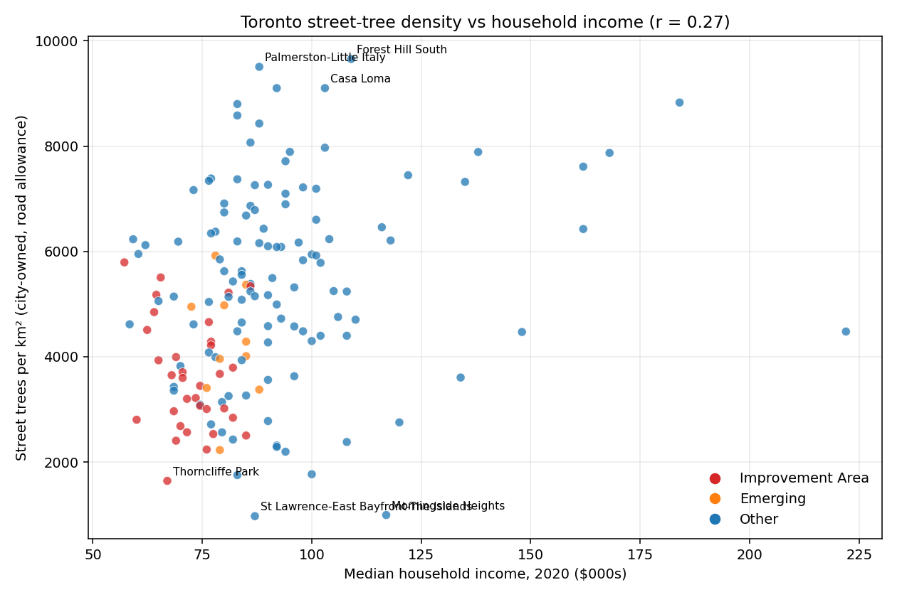
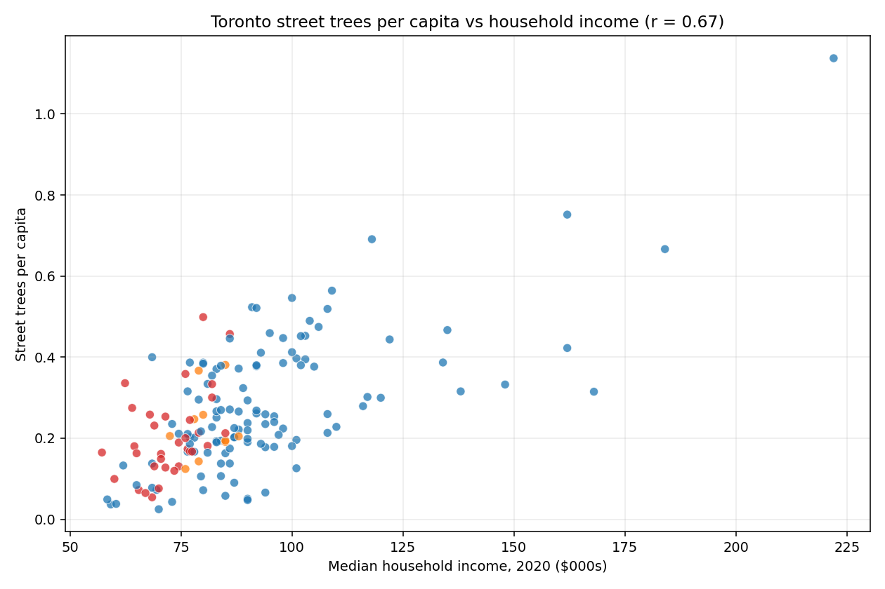
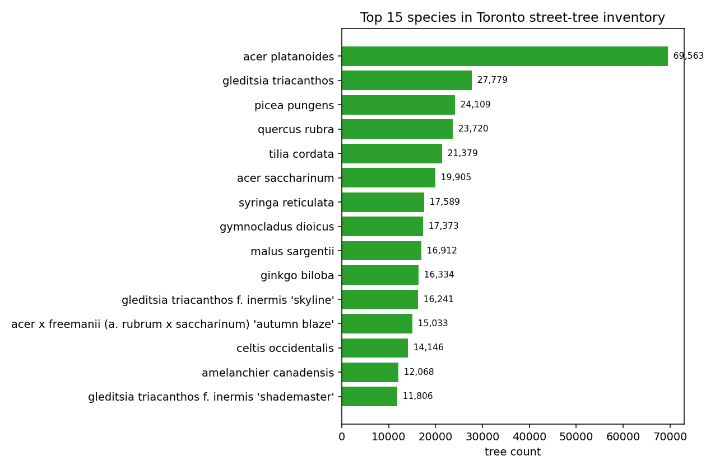
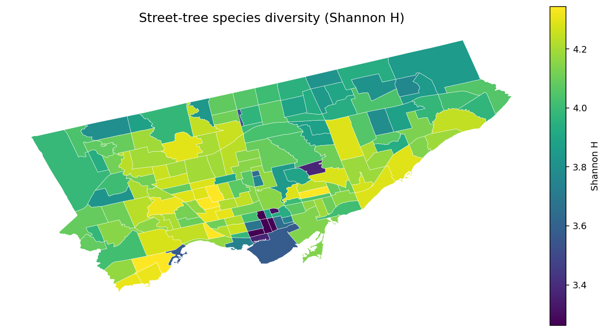

# Toronto's canopy is unequally shared — and the city no longer plants its most common tree

*Draft. Using 2021 census data + the current Street Tree inventory on Toronto Open Data.*

---

There are **689,013 trees** on Toronto's city-owned road allowances. One in ten of them is a Norway maple — a species the city **no longer plants**. Another way to put it: Toronto's signature street tree is a European import we've quietly decided was a mistake, and it still dominates our canopy.

That's the kind of thing that jumps out when you sit down with the inventory. Here are four more findings from an afternoon of poking at the data.

## 1. "Trees per km²" makes the city look more equal than it is

If you plot each of Toronto's 158 neighbourhoods with median household income on one axis and street-tree **density** (trees per km²) on the other, you get a loose positive slope. Correlation: **r = 0.27**. Real, but not dramatic. You'd be forgiven for concluding Toronto does okay on canopy equity.

But trees-per-km² is the wrong lens. A tight downtown block has short streets, and short streets have a lot of boulevard trees crammed into a small polygon. That makes Thorncliffe Park (median income $67k, a Neighbourhood Improvement Area) look denser than Bridle Path (median $222k), simply because Thorncliffe is physically smaller.

Switch to **trees per capita** and the picture changes sharply. Correlation jumps to **r = 0.67**. The Neighbourhood Improvement Areas — the city's formal list of historically under-invested neighbourhoods — cluster in the bottom left:

Average trees per capita:
- Non-NIA neighbourhoods: **0.28**
- Emerging neighbourhoods: **0.28**
- NIAs: **0.20**

A 40% gap. When we say NIAs were historically under-invested, we mean in things like libraries and transit and parks — but also, literally, in trees.

## 2. A Bridle Path resident has 23× more city-owned trees per capita than someone in North Toronto

The extremes:

| Most trees per capita           | trees/person | Fewest trees per capita   | trees/person |
| ------------------------------- | ------------ | ------------------------- | ------------ |
| Bridle Path-Sunnybrook-York Mills | 1.14       | North Toronto             | 0.025        |
| Princess-Rosethorn              | 0.75         | North St. James Town      | 0.037        |
| St. Andrew-Windfields           | 0.69         | Church-Wellesley          | 0.038        |
| Kingsway South                  | 0.67         | Yonge-Doris               | 0.043        |
| Forest Hill South               | 0.56         | Harbourfront-CityPlace    | 0.047        |

Some caveats matter here:
- This is **city-owned** street trees only. Private-property trees aren't counted. High-rise-heavy downtown neighbourhoods under-index partly because there's no single-family front yard.
- It's also a population-density effect: 30,000 people in a CityPlace condo tower don't get more street trees than 30,000 people in Rosedale just because they exist.

Both of those are fair. But neither explains away the NIA gap in the main scatter. A place like **Thorncliffe Park** — 15,000 residents, mostly families, one of the densest neighbourhoods in North America, a formal Neighbourhood Improvement Area — sits at 0.065 trees per capita. A mature single-family neighbourhood of similar population would be 4–10× higher.

## 3. Toronto's #1 street tree is one the city no longer plants

Norway maple (*Acer platanoides*) is **10.1%** of all Toronto's city-owned street trees — 69,563 of them. The next most-common species is honey locust at 4%, then Colorado blue spruce, red oak, and littleleaf linden. Five species make up a quarter of the entire canopy.

Here's the thing: Norway maple isn't on Toronto's current [species-planted-on-streets list](https://www.toronto.ca/services-payments/water-environment/trees/tree-planting/species-planted-on-streets/). It's an invasive, outcompetes native maples in ravines, hosts fewer insect species than oaks or willows, and casts such dense shade that almost nothing grows underneath. The city has been quietly replacing it for years. But you can't rip out 70,000 trees, so the result is a historical canopy dominated by a species the city has officially regretted.

If you've noticed more "mystery cultivar" maples and honey locusts going in on your street over the last decade — that's why.

## 4. Downtown Toronto's street trees are the least diverse in the city

For each neighbourhood, the Shannon diversity index (H) captures how "even" the species mix is. Higher is more varied.

The downtown core has the **lowest** diversity in the city:

| Lowest-diversity neighbourhood          | Shannon H | Dominant species            | % of stock |
| -------------------------------------- | --------- | --------------------------- | ---------- |
| Yonge-Bay Corridor                     | 2.78      | Honey locust                | **22.9%**  |
| Downtown Yonge East                    | 3.04      | Honey locust                | **31.5%**  |
| Bay-Cloverhill                         | 3.22      | Honey locust                | 19.0%      |
| Wellington Place                       | 3.26      | Honey locust                | 23.9%      |
| North St. James Town                   | 3.31      | Norway maple                | 21.2%      |

Honey locust's dominance downtown makes a lot of sense — it's tolerant of salt, pollution, compacted soil, and narrow tree pits. It also provides dappled shade rather than dense shade, so the light that does reach the sidewalk stays pleasant. It's the right species for the conditions. But **31% of one species in one neighbourhood** is not a good situation. The last time Toronto trusted a single genus this heavily, it was elms — and Dutch elm disease took most of them in the mid-20th century. Emerald ash borer did it again to ashes more recently.

A honey locust pest or disease would gut downtown's canopy in a decade.

## 5. What we can't tell from this data

Three things the inventory **doesn't** include:

- **Planting dates.** The dataset is a snapshot. We can't say what the canopy looked like in 2000, or how much of it EAB (emerald ash borer) took. The DBH — diameter at breast height — is a rough proxy for age, but a bad one across species. A 50cm silver maple is much younger than a 50cm oak.
- **Trees on private property or in parks.** About 60% of Toronto's actual tree canopy (by crown cover) is on private land. This dataset covers the strip between your sidewalk and the road. Your backyard oak isn't here.
- **Tree health or mortality.** We know what's there. We don't know what's dying.

Those are the three things I'd most want next. The city publishes [LiDAR-based canopy cover layers](https://www.toronto.ca/services-payments/water-environment/trees/) from UFORE/i-Tree studies — those would fill in the private-land half. Archival snapshots of the street-tree inventory (if any exist) would unlock the temporal picture.

## What's on your block?

I built a small companion site — type your address and see what's in front of your house, with species, Wikipedia photos, bloom times and fall color. It's at **[ttarabula.github.io/torontotrees](https://ttarabula.github.io/torontotrees/)**.

---

*Data: [Street Tree Data](https://open.toronto.ca/dataset/street-tree-data/), [Neighbourhood Profiles 2021](https://open.toronto.ca/dataset/neighbourhood-profiles/), [Neighbourhoods](https://open.toronto.ca/dataset/neighbourhoods/) — all City of Toronto, OGL-Toronto. Full source + reproducible pipeline on GitHub.*
